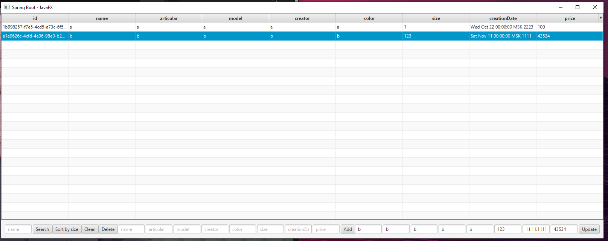

#ПСП задача 6

GUI-приложение (коллекции). Разработать контейнерный класс «Магазин одежды», элементы которого содержат информацию о продаваемой одежде. Каждый объект одежды содержит поля: наименование товара, артикул, модель, производитель, цвет, размер, дата выпуска, цена. Разместить объекты одежды в контейнере в алфавитном порядке. Реализовать в контейнере метод, сортирующий одежду по размеру, а также метод, осуществляющий поиск одежды одного наименования. Результаты выводить в таблицу. Контейнер должен иметь возможность добавления, удаления и редактирования объектов одежды.

`mvn clean package`

`java -jar target/psp_6-0.0.1-SNAPSHOT.jar`

